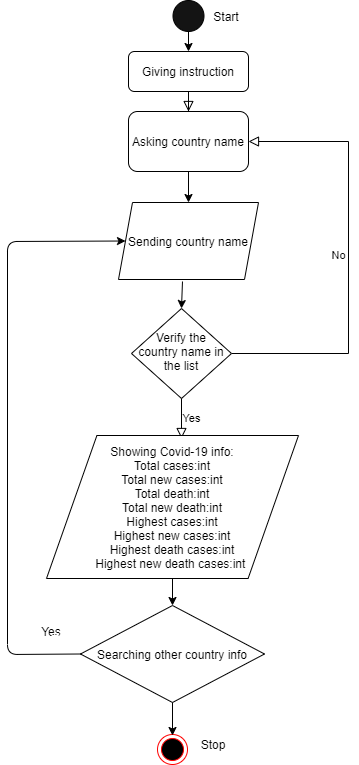
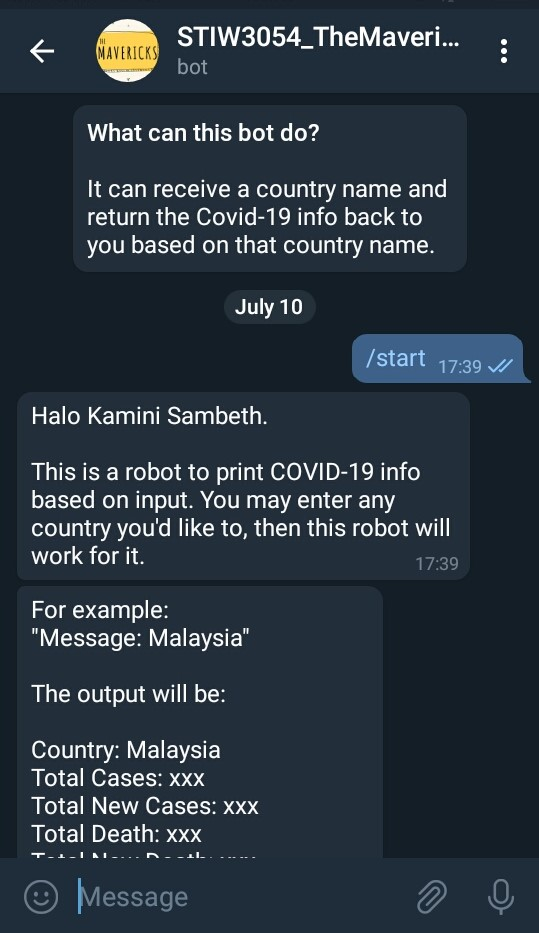
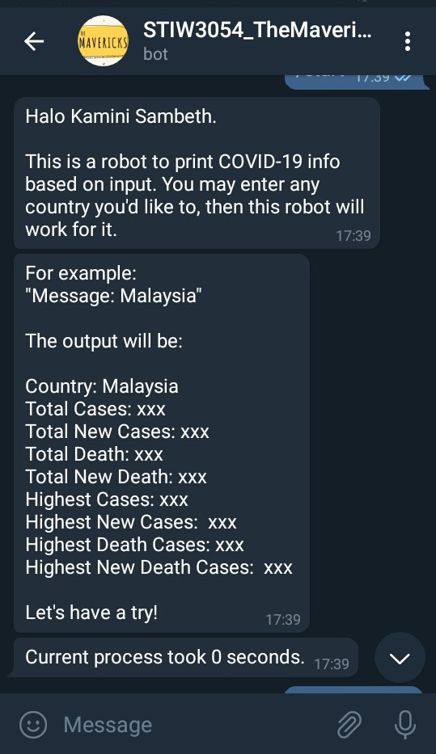
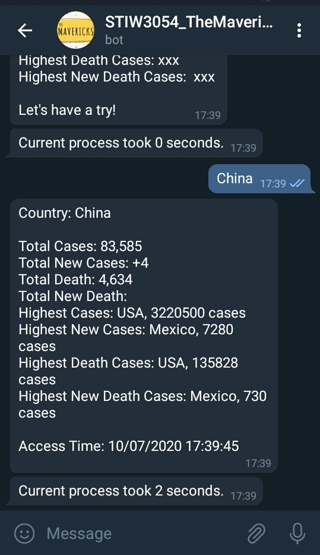
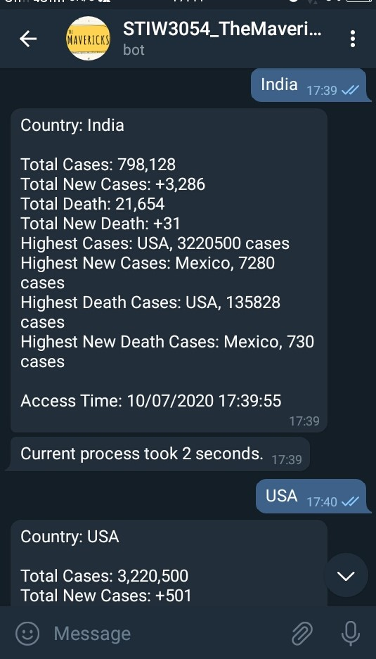
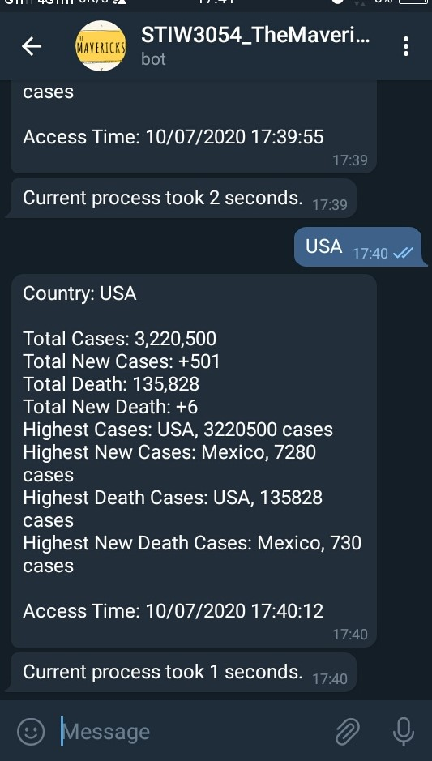

## Group Info:
1. Matric Number & Name & Photo

    
### Leader:
262364 Hong Xin Yin    
    

### Group Members:
262543 Ooi Gi Yuen    

261589 Ho Jia Hui    
    

252849 Kamini Sambeth    
    

261938 Lim Wen Liang    
    

2. Other related info (if any)

## Introduction

The STIW3054_TheMavericks_bot is a real-time Covid-19 information tracker by searching country name.  
-It can receive country name from user and get the Covid-19 information based on the country name.  
-Later it will show the Covid-19 information to user, which are:  
*Country Name  
*Total Cases  
*Total New Cases  
*Total Death  
*Total New Death  
*Highest Cases  
*Highest New Cases  
*Highest Death Cases  
*Highest New Death Cases  

## Flow Diagram of the requirements
  

## User manual
Steps:  
1.Once user open the bot link it will navigate to telegram bot . 
2.User will get the information about the bot and how it will works. 
3.By click the start button the bot will give instruction message to guide them with an example output. 
4.The bot will ask a country name. 
5.User may enter a country name to get the info about the Covid-19 cases. 
6.Once the user enter the country name, the system will get the the Covid-19 information based on the country that user enter. 
7.The Covid-19 information regarding to the country will be display on telegram bot interface. 
8.If users want to know about other country they can enter the country name as much as they want. 
## Result/Output (Screenshot the telegram bots)
   
   
   
   
   

## UML Class Diagram
   

## Youtube Presentation

## References

1. Mix TV. (2018, Feb 18). Mix TV: How to create Telegram Bot in Java [ Tutorial ]. Retrieved from https://www.youtube.com/watch?v=xv-FYOizUSY

2. Jonathan Hedley. (n.d.). jsoup: Java HTML Parser. Retrieved June 8, 2020, from https://jsoup.org/

3. SoftwareDeveloperNotes. (2020, Jun 15). SoftwareDeveloperNotes: Java IO | How to write & read multiple objects from a file. Retrieved from https://www.youtube.com/watch?v=l__bi60QeBU

4. Tutorials Point. (n.d.). Java Tutorial. Retrieved Jun 24, 2020, from https://www.tutorialspoint.com/java/index.htm

## JavaDoc
